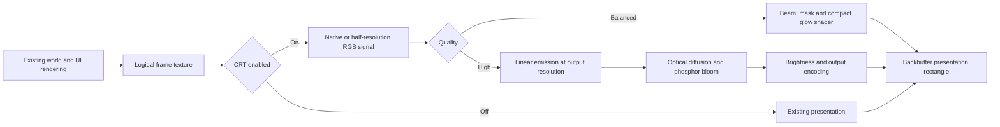

# CRT filter: implementation and research

Status: revised the desktop implementation after the user's evaluation of the
first build. Their screenshots showed weak scanlines, masks that disappeared at
ordinary window sizes, and insufficient distinction between presets. This
revision is reviewed in source only. At the user's request, agent work does not
build the application, compile effects, run tests, launch the game, or benchmark it.

Scope update: desktop only. Browser CRT support is deferred. Do not add or run
tests, build a test harness, or make a formal QA matrix part of this work. Visual
tuning against CRT references remains part of implementing the requested look.

Research dates: 2026-09-23 and 2026-09-24. Code inspected: the working tree based on
`380541c9584680ddca13316b2acd7870948c8d00`, including existing uncommitted changes.

## Using the implementation

At the main menu, press **C**, **R**, then **T** to reveal the CRT controls for the
current session, with no more than three seconds between letters. Open
**Settings > Graphics** and expand the **CRT** section.
The section starts collapsed and contains every CRT control. Unlocking the
section does not itself enable the filter; saved filter preferences apply even
while its controls are hidden. Browser builds do not expose this section.

Select **PC CRT**, **Studio RGB**, **Arcade RGB**, or **Home TV RGB**. New installations
default to **Off**. Quality is independently selectable as **Auto**, **Balanced**,
or **High**; the menu displays the effective quality or fallback. Curvature is
optional and defaults to disabled. Brightness ranges from 75% to 125% in 5% steps;
**Reset CRT Settings** restores all defaults, including Off.

**CRT Signal** selects **Preset**, **Native**, or **Classic (half)**. Preset uses
Native for PC CRT and Classic for Studio RGB, Arcade RGB and Home TV RGB. Native
retains the composed image's full raster. Classic averages each 2×2 group in
linear light before reconstructing the CRT image: the default 960×540 becomes
480×270. This provides room for visible scanline gaps and combines fine pixel
boundaries, with a deliberate reduction in text and HUD detail. It preserves the
game's aspect ratio, field of view, simulation and pointer coordinates.

The existing INI settings section stores `CRT Preset` (0 Off, 1 PC CRT, 2 Studio
RGB, 3 Arcade RGB, 4 Home TV RGB), `CRT Quality` (0 Auto, 1 Balanced, 2 High),
`CRT Signal` (0 Preset, 1 Native, 2 Classic),
`CRT Curvature` (boolean), and `CRT Brightness Percent` (75–125). Invalid enum
values return to defaults; brightness is clamped to its supported range.

Desktop now requests HiDef at startup. Auto attempts High on HiDef, subject to
resource limits and successful effect/target use; it does not measure GPU speed.
High uses five passes and one full-size plus two quarter-size `HalfVector4`
targets, preceded by one signal-conversion pass when Classic is selected. Balanced
also uses that optional signal pass. A 96 MiB budget and 4096-pixel dimension limit
bound High intermediates.
Unavailable High resources fall back to Balanced, and unavailable CRT presentation
falls back to the existing renderer without changing saved preferences.

Recovery switches: `--crt=off` disables CRT for that launch;
`--force-reach` selects Reach and takes precedence over `--force-highdef` if both
are supplied. Equivalent environment variables are `OPENGARRISON_CRT=off` and
`OPENGARRISON_FORCE_REACH=1`. The existing `OPENGARRISON_FORCE_HIGHDEF=1` remains
recognized. Profile changes require restarting; changing CRT settings does not.

Implementation locations:

- `Client/Rendering/Crt/`: renderer, preset definitions, and shared CPU geometry.
- `Client/Content/Crt*.fx`: Balanced and High effect sources, registered in MGCB.
- `Client/Game/Core/Game1.CrtPresentation.cs`: lifecycle, fallback and mouse mapping.
- `Client/Game/Menus/Game1.CrtOptions.cs`: controls and persistence integration.
- `Core/Configuration/Crt*Kind.cs`: stable persisted preset, quality and signal IDs.

Browser controls and rendering remain outside this feature. Calibration patterns,
hold-to-compare controls, a sharp-UI layer, analog signal artifacts and temporal
simulation are deferred. Presets are reference-informed display-family
approximations with provisional values, not calibrated reproductions of named tubes.

## Recommendation

Implement CRT as an optional desktop final presentation stage, with four display
presets and separate quality controls. Preserve the existing renderer when Off.
Build a portable spatial simulation first, then a higher fidelity optical path.
Use established CRT implementations as algorithm references and comparison
targets; tune the result against calibration images and, where available, measured
or photographed hardware.

For the user's low-resolution sprite reference look, start with **Arcade RGB**
and **CRT Signal: Preset**. **PC CRT** retains the native progressive framebuffer
by default. **Studio RGB**, **Arcade RGB**, and **Home TV RGB** provide distinct tube
characteristics. These are display-family interpretations until calibrated to a
specific device and input mode. Avoid model-number branding or claims of exact
hardware reproduction without that evidence.

A realistic result needs credible beam reconstruction, phosphor structure, color
response, and light spread. Curvature, signal noise, and convergence errors are
separate properties. More of each does not automatically mean greater accuracy.
The research references distinguish these features; MAME, for example, exposes
separate controls for scanlines, masks, defocus, convergence, persistence, and
bloom. [MAME HLSL documentation](https://docs.mamedev.org/advanced/hlsl.html)

## Verified integration points

| Area | Current behavior | Implementation consequence |
| --- | --- | --- |
| [Desktop project](../../Client/OpenGarrison.Client.csproj) | .NET 10; MonoGame DesktopGL 3.8.4.1 | Target the existing HLSL Effect/content pipeline. |
| [Browser project](../../Client.Browser/OpenGarrison.Client.Browser.csproj) | KNI 4.2.9001.2; shared client built with `BROWSER_KNI` | Keep CRT inactive and its controls hidden in browser builds; defer browser assets and rendering support. |
| [Display scaling](../../Client/Game/Core/Game1.DisplayScaling.cs) | `BeginLogicalFrame` / `EndLogicalFrame` own the logical target and final PointClamp blit | Replace the final presentation only when CRT is effective. |
| Logical resolution | 960×540 default; 800×600 and 780×624 alternatives | Pass actual source dimensions; never assume a 240-line input. |
| Direct rendering | `ShouldRenderDirectlyToBackBuffer` bypasses the texture when output equals logical size | CRT must force an offscreen source even at 100% window size. Off must retain the bypass. |
| Scaling | Aspect-preserving Fill, potentially fractional; old Pixel-Perfect behavior is explicitly retired | Handle fractional scales without changing field of view, aspect ratio, or the retired setting. |
| [Graphics initialization](../../Client/Game/Core/Game1.cs) | Desktop now requests HiDef with an explicit Reach recovery override; browser retains HiDef | Do not assume full-resolution floating-point targets are available on every desktop. |
| [Frame controller](../../Client/Game/Core/Game1.FrameController.cs) | Startup and menus use the same logical-frame boundary | The presentation stage can cover menus and gameplay consistently. |
| [Gameplay composition](../../Client/Game/Gameplay/Runtime/Game1.GameplayOverlayDrawController.cs) | World, HUD, voice, modal menus, loading and version overlays precede `EndLogicalFrame`; nav-editor presentation follows it | Full-screen CRT fits here. Preserve editor gutter behavior and avoid processing captures twice. |
| [HUD composition](../../Client/Game/Gameplay/Hud/Core/Game1.GameplayHudRendering.cs) | Separate HUD target is currently conditional on lowered HUD opacity and disabled in browser | A clean-HUD option requires a deliberate layer split; existing HUD target is not a universal solution. |
| [Camera](../../Client/Game/Gameplay/Runtime/Game1.CameraViewState.cs) | Zoom levels 1, 1.25 and 1.5; smoothing and panning | CRT source grid is the final logical frame, independent of camera movement. |
| [Input scaling](../../Client/Game/Core/Game1.DisplayScaling.cs) | Ordinary rectangle scaling plus matching CRT geometry after a successful curved presentation | Preserve native editor gutter coordinates and avoid mapping controller reticles twice. |
| [Settings](../../Client.Shared/Configuration/ClientSettings.cs) | Desktop maps through `OpenGarrisonPreferencesDocument` to INI | Implement desktop persistence, normalization and migration defaults. |
| [Graphics menu](../../Client/Game/Menus/Game1.OptionsMenuController.cs) | Tabbed actions; GG2-only builds have a label allowlist | Add controls to the intended editions and update the allowlist. |
| [Content](../../Client/Content/Content.mgcb) | DesktopGL, Reach profile; Grayscale and FlamingLogo effects | Use the established loading conventions, explicit effect parameters and lifecycle ownership. |
| [Browser content cache](../../Tools/Browser/browser_build_cache.py) | Copies compiled desktop content outputs | Do not make CRT assets required by the browser or add browser content work to this implementation. |

These facts came from source inspection. This task did not launch the game, compile
a new shader, or measure GPU time.

## Research decisions

| Reference | Useful evidence | Decision for this game |
| --- | --- | --- |
| [Timothy Lottes CRT shader](https://github.com/libretro/slang-shaders/blob/afb1416b6b85d3e53c6e586a9209cb9097c7b4a4/crt/shaders/crt-lottes.slang) | Readable reconstruction kernels, linear/sRGB conversions and mask functions; header identifies the original shader as public domain and RGB arcade oriented | Good basis for the portable prototype and mask experiments. It is not itself proof of an exact CRT model. |
| [CRT-Royale documentation](https://docs.libretro.com/shader/crt_royale/) and [pipeline](https://github.com/libretro/slang-shaders/blob/afb1416b6b85d3e53c6e586a9209cb9097c7b4a4/crt/crt-royale.slangp) | Beam shaping, mask pitch and resampling, diffusion and phosphor bloom; the inspected preset has 12 passes | Fidelity reference for the High path. A complete port would also require its render graph, textures and sampling conventions. |
| [CRT Guest Advanced](https://github.com/libretro/slang-shaders/blob/afb1416b6b85d3e53c6e586a9209cb9097c7b4a4/crt/shaders/guest/advanced/crt-guest-advanced.slang) | Brightness-dependent beam controls, glow and high-resolution/interlace handling; inspected file is GPL-2.0-or-later | Comparison target for beam response and readability. Audit every copied dependency, not just the top-level shader. |
| [yo6snap's KV-M1420B work](https://forums.libretro.com/t/sony-tv-trinitron-kv-m1420b/22901) | Author describes mapping a specific tube's geometry and phosphor arrangement from observations and photographs | Model-specific realism should follow evidence of this kind. One TV's measurements must not become universal defaults. |
| [Sony PVM documentation](https://pro.sony/s3/cms-static-content/operation-manual/3865058221.pdf) | Specifies horizontal resolution and grille pitch separately | Keep scanline count, phosphor pitch and horizontal TV-line resolution distinct in the design. |
| [MonoGame custom effects](https://docs.monogame.net/articles/getting_started/content_pipeline/custom_effects.html) | Desktop GL effects use supported HLSL profiles and translation; parameters require explicit handling | Port the required math into compatible Effects, with bounded kernels and no assumption that Slang files load directly. |

Repository [LICENSE](../../LICENSE) states GPLv3. For any imported code or mask LUT,
record upstream URL, immutable revision, author, per-file license, dependencies and
local modifications. Preserve notices. The inspected Lottes header and Guest file
do not establish licenses for every file in their repositories.

The effects in this implementation are new code informed by the research above.
No upstream shader source or mask assets were copied or ported.

## Presets and settings

Default for new installations: **Off**; existing selections are retained. The
recommended starting point for the supplied references is Arcade RGB. The following
are calibration targets, not measured parameter
values or finished visual results.

| Preset | Intended character | Calibration priorities |
| --- | --- | --- |
| PC CRT | Progressive RGB computer monitor with a fine staggered shadow-cell approximation | Native signal, restrained line gaps, focused text and small optical spread. |
| Studio RGB | High-quality aperture-grille video monitor | Narrow scanline beams, continuous RGB columns, clean focus and tight glow; Classic signal by default. |
| Arcade RGB | RGB arcade monitor with a slot mask | Broader beam, coarser phosphor structure, stronger local light spread; optional gentle geometry. |
| Home TV RGB | Consumer color tube using clean RGB input and larger staggered shadow cells | Softer horizontal reconstruction, broader beams and a different cell pitch, fill and stagger. Rectangular cells approximate the mask; convergence errors and composite artifacts are not implemented. |

Tube preset and quality are independent: a PC CRT can use High quality, and a Home
TV can use Balanced. Low quality should simplify the calculation while retaining
the chosen display family's character.

Initial Graphics controls:

- **CRT Filter:** Off / PC CRT / Studio RGB / Arcade RGB / Home TV RGB.
- **CRT Quality:** Auto / Balanced / High. Show the effective level when a fallback
  applies; Auto initially chooses by validated capabilities, not an unexplained
  continuous adjustment during play.
- **CRT Signal:** Preset / Native / Classic (half), independently selectable from quality.
- **CRT Curvature:** Off / Preset, implemented together with matching input mapping.
- **CRT Brightness:** 75%–125% in 5% steps.
- **Reset CRT Settings:** restore Off, Auto, Preset signal, flat geometry and 100% brightness.

Preview patterns and hold-to-compare are future calibration aids, not controls
implemented in this version. Detailed beam/mask parameters remain in source.

Use stable preset IDs and explicit enum values; do not persist menu indices.
Missing/invalid preset values resolve to Off. Normalize all numeric values.
Store requested settings separately from
effective capabilities so a fallback does not erase player preferences.

The initial release processes the composed world and game UI together, which is
consistent with displaying the whole game on a tube. Preserve text and reticle
readability. An optional **Keep UI sharp** mode is a later, deliberate layer
split covering HUD, chat, menus, cursor and plugin overlays; it must not simply
reuse the current conditional HUD target.

## Resolution and realism contract

Maintain three distinct coordinate systems:

1. Source raster: 960×540, 800×600 or 780×624, as actually rendered; optionally
   converted to a half-size RGB signal before beam reconstruction.
2. Simulated tube: beam spacing, phosphor pitch, geometry and optical behavior.
3. Output raster: physical drawable pixels in the presentation rectangle.

Scanline structure follows the selected signal raster. Phosphors are attached to the
simulated screen, never to camera coordinates. With curvature, the tube's
structure must project with its glass geometry, with suitable filtering.

At 1080p, a 540-line source has only two output pixels per line. A 600-line source
has 1.8 when filling the output height; at 720p the 540-line source has about 1.33.
These are materially different sampling conditions. Integrate beam coverage over
the output pixel footprint and smoothly reduce unresolved line/mask contrast.
Account for the curved corners as well as the center. Do not replace this with alternating
black output rows or a scrolling sine pattern. Libretro explicitly notes the
aliasing sensitivity of repeating CRT patterns and fractional scaling.
[CRT shader overview](https://docs.libretro.com/shader/crt/)

Choose mask pitch from the output sampling budget and intended tube pitch. A
simple RGB triad already needs three full output pixels for one pixel per stripe;
this is only a starting sampling floor, not a guarantee for every mask or panel.
Prefer a filtered neutral contribution to unstable colored moire when undersampled.
Compare at native screenshot size; a resized preview cannot validate a fine mask.

The first revision kept every preset at the native 540/600/624 raster. The user's
visual feedback specifically calls for the reconstructed low-resolution sprite
look, so the new **CRT Signal** control makes the tradeoff explicit. Classic uses
half dimensions, not a claim of exact 240p/480i timing or a forced television
aspect ratio. The filter must not crop the playfield or change camera zoom. Native
remains available for small-text readability.

## Rendering architecture

Add a narrowly scoped `CrtPresentationRenderer` owned by the client lifecycle,
supported by immutable `CrtPresetDefinition` and a pure `CrtPresentationMapping`
helper, with resource capability handling inside the renderer. Keep configuration types free of graphics
dependencies where practical. `Game1` coordinates these components; it should not
contain the optical model as another large set of unrelated fields.

Implemented source flow:

The Off branch is conceptual: retain the current direct-to-backbuffer path too,
so Off does not acquire a new mandatory render target or full-screen pass.

### Portable Balanced path

Use the existing opaque logical-frame texture, optionally convert it to the
Classic signal, then apply a single final shader pass.
Reconstruct source samples with a bounded horizontal filter and vertical beam
profile, modulate a filtered procedural/LUT mask, add a compact optical-spread
approximation, and encode the output. Work at the actual presentation dimensions.
Avoid temporal history and additional full-output targets in this path.

The Off setting retains the existing PointClamp presentation; there is no separate
beam/mask bypass setting. Bind final presentation as
opaque with explicit sampler, depth, rasterizer and blend state. An effect with
multiple passes does not automatically create or manage a postprocessing graph.

### High path

The source implements a bounded five-pass graph:

1. Reconstruct beam emission into an output-sized linear floating-point target.
   Evaluate output-to-source geometry here, and antialias the projected mask.
2. Derive a reduced-resolution optical-spread buffer from emitted light.
3. Apply horizontal blur to the reduced-resolution buffer.
4. Apply vertical blur at the same scale.
5. Combine direct emission and optical spread, manage highlights, and encode
   once into the backbuffer at matching pixel dimensions.

The final pass must not resize or warp an already resolved mask a second time.
Specify each resource's size, encoding, format, filtering, lifetime and ownership.
Keep input and output textures distinct. No per-frame allocations or readbacks.
Cache effect parameter handles and fixed preset kernels.

Classic signal conversion owns a small half-size `Color` target. Its four source
texels are fetched individually, decoded, averaged and encoded for storage. Beam
reconstruction then decodes that signal as usual. Using a separate pass keeps
the main beam kernel bounded and prevents repeated 2×2 fetches for every beam tap.
The native logical frame remains the input-coordinate reference.

The renderer owns an isolated SpriteBatch and replaces it after a failed pass.
This is required for reliable fallback: the pinned MonoGame batcher clears its
queued-item count only after completing a draw, so ending a failed shared batch
alone would not reliably empty it. Returning from intermediate targets
clears the backbuffer again before either final presentation path, preserving black
letterboxing with discard-content behavior.
[MonoGame SpriteBatcher source](https://github.com/MonoGame/MonoGame/blob/v3.8.4.1/MonoGame.Framework/Graphics/SpriteBatcher.cs)

Prefer `HalfVector4` only after allocation, rendering, sampling and filtering have
been validated on the active backend. It is a 64-bit format, while `Color` is
32-bit; the existence of an enum is not proof of device support.
[MonoGame surface formats](https://docs.monogame.net/api/Microsoft.Xna.Framework.Graphics.SurfaceFormat.html)

### Reach and HiDef on this desktop backend

Before this change the client left its default `GraphicsDeviceManager` profile
at Reach, with `OPENGARRISON_FORCE_HIGHDEF=1` for desktop diagnostics. Reach's
intended benefit was a conservative compatibility target, not inherently
faster rendering. HiDef expresses a richer feature target for larger textures,
floating-point processing and more advanced rendering.
[Profile comparison](https://docs.monogame.net/articles/getting_to_know/whatis/graphics/WhatIs_GraphicsProfile.html)

Correction to the initial research: do not treat the old XNA profile table or the
client's 2048-pixel comment as a proven hard ceiling in this DesktopGL build.
MonoGame 3.8.4.1 queries `GL_MAX_TEXTURE_SIZE` and derives floating-point support
from OpenGL version/extensions. Its legacy adapter implementation even returns
true for HiDef with a TODO to check capabilities. Therefore changing the profile
flag alone does not establish larger buffers or better precision on this backend.
[OpenGL device source](https://github.com/MonoGame/MonoGame/blob/v3.8.4.1/MonoGame.Framework/Platform/Graphics/GraphicsDevice.OpenGL.cs),
[capability source](https://github.com/MonoGame/MonoGame/blob/v3.8.4.1/MonoGame.Framework/Platform/Graphics/GraphicsCapabilities.OpenGL.cs),
[adapter source](https://github.com/MonoGame/MonoGame/blob/v3.8.4.1/MonoGame.Framework/Platform/Graphics/GraphicsAdapter.Legacy.cs)

The implementation requests HiDef for the richer desktop CRT path, with runtime
handling of the actual requested formats and dimensions. Do not reset the device on preset
changes or use `IsProfileSupported` alone as proof. Retain Balanced/Off fallback
when required resources are unavailable. Balanced avoids full-output intermediate
targets by writing directly to the backbuffer. `--force-reach` provides an explicit
startup recovery option; the implementation does not attempt automatic device
recreation if startup itself fails.

### Color and optical behavior

Treat the existing composed texture as display-encoded input, accounting for the
current upload/render path when tuning grayscale ramps. Decode fetched texels before
light-domain reconstruction and optical accumulation; encode the finished image
once. Do not make a global gamma change to every existing sprite renderer as part
of this feature. Input transfer, tube response and output transfer must be named
separately to avoid double correction.
[Poynton's gamma reference](https://poynton.ca/PDFs/GammaFAQ.pdf)

Normalize reconstruction energy and track mask average transmission. Brightness
compensation must preserve near-black detail and avoid clipping saturated team
colors and highlights. Some SDR brightness loss is unavoidable for strong dark
gaps at limited peak luminance; do not conceal it with arbitrary saturation.
Use ramps and white patches to choose a bounded compensation curve.

The shared shader uses piecewise sRGB transfer functions, three horizontal samples
per row and five neighboring source rows (15 source fetches). The horizontal
Gaussian weights have compact, smoothly tapered support and are normalized and
reused for all five rows. Beam width varies with row luminance; output-pixel coverage is
approximated by adding footprint variance (`footprint² / 12`) to beam variance.
Gaussian normalization uses source-line units to maintain brightness across
output scales. This finite kernel is an
approximation, especially under strong downscaling, and needs visual evaluation.
The mask uses box-integrated RGB stripe coverage and staggered-row coverage,
with unresolved slot modulation reduced toward its spatial mean. Derivatives of
the curved mapping supply local footprints, including at the corners.

PC CRT, Studio RGB, Arcade RGB and Home TV RGB use minimum full-triad pitches of
3, 3.5, 4.5 and 5.5 output pixels respectively. Studio uses continuous grille
columns; Arcade uses elongated staggered slots; PC and Home use rectangular
shadow-cell approximations with different pitch, fill and row stagger. High
spreads bright emission locally with a bounded nine-sample neighborhood, using
per-channel extraction so saturated phosphors contribute, and adds restrained
quarter-resolution diffusion. Balanced approximates local spread by reducing
mask contrast at bright drive; it does not perform High's spatial bloom.

The visual revision separates horizontal signal focus, vertical beam width,
tight phosphor bloom and broader diffusion. A minimum resolvable output mask
pitch keeps ordinary desktop windows from fading every preset toward the same
neutral texture. Coarsening a mask at small output sizes is a deliberate display
adaptation, not a measurement of a particular tube's fixed physical pitch.
The reference photographs are close-ups: their apparent phosphor size should be
compared with enlarged game crops, while overall readability is judged at normal
game size. CRT-Royale likewise treats mask pitch, beam distribution, bloom and
diffusion as separate controls.
[CRT-Royale documentation](https://docs.libretro.com/shader/crt_royale/)

Make beam width depend on brightness where the selected reference warrants it.
Keep optical spread local and calibrated. A global blur, lifted black background,
or a wide neon halo is not a substitute for this model. Retain High and Balanced
reference captures so their approximations are explicit.

## Geometry and input correctness

Centralize one mapping with an unambiguous convention:

`logicalUV = OutputToSource(normalizedPointerInsidePresentationRectangle)`

The shader samples source pixels through that same output-to-source mapping. CPU
input therefore uses the same direction of transform; source-to-screen drawing
of an unfiltered overlay needs the inverse. Do not apply an arbitrary inverse
barrel formula to mouse input and assume it matches the shader.

Apply the mapping to mouse aiming, scoped aiming, menus, sliders, HUD editor and
software cursors. Controller reticles already operate in logical source space
and must not be mapped a second time. Define behavior outside the
curved visible surface; those locations should not activate invisible menu items.
Fit the full source image inside the curved surface, with default overscan zero.
Implement curvature and this mapping together. Core simulation and network aiming
receive the mapped logical coordinates through the existing input flow.

Use desktop drawable dimensions and the presentation origin, accounting for DPI
scaling. A later resize of the resolved phosphor pattern can invalidate its
sampling, so the final shader output must match its destination pixels.

## Lifecycle, fallback and diagnostics

- Load lazily or during a controlled content stage; do not repeatedly compile or
  allocate when cycling presets. Do not add shader work to the simulation tick.
- Recreate owned resources after size/profile/device changes; skip zero-sized
  minimized surfaces.
- On supported, recoverable CRT load/allocation failure, retain a usable Off or
  Balanced renderer and report the effective state once. Do not swallow unrelated
  renderer exceptions or retry a failing allocation every frame.
- Provide a startup override such as `--crt=off` for recovery, preserving stored
  preferences. Add diagnostics for requested/effective preset and quality, source
  and output dimensions, graphics profile, target formats and fallback reason.
- Use the existing bootstrap unload point to dispose owned targets. Let the
  ContentManager retain ownership of content-loaded Effects.
- Apply CRT once at final presentation, including frames that use deathcam or
  Last to Die captures. Captured world textures remain unfiltered inputs.

## Performance and visual tuning

Proposed engineering budgets, not benchmark claims: Balanced should add at most
about **1 ms GPU time at 1080p** on a selected minimum supported integrated GPU;
High should target **2 ms at 1440p** on a documented mainstream reference GPU.
These are design goals, not a required benchmark project. Keep kernel work and
buffer resolution proportional to the selected quality. Do not lower gameplay
simulation or cap player frame rate to hide cost.

A full 4K RGBA16F target uses about 63.3 MiB; two already use about 126.6 MiB before
other game resources. Account for this in resource allocation. A CPU stopwatch
around draw submission does not measure shader completion.

Tune with gameplay images and simple grayscale, color and fine-detail references
at the actual source resolution. Preserve both teams' colors, small projectiles,
chat and menu readability. Inspect masks at native output size because rescaled
previews can change their appearance. No dedicated diagnostic scene, automated
tests, screenshot comparison system or formal release matrix is planned.

Calibration protocol: choose the intended tube and input mode, record viewing
distance and lighting, match framing and luminance, use locked camera exposure
and white balance, and compare both full images and phosphor closeups. Photographs
can introduce their own moire and rolling-shutter artifacts. Without hardware
evidence, describe results as reference-informed approximations and retain that
limitation in release notes.

## Implementation sequence

1. **Desktop renderer foundation.** Resolve HiDef startup selection, actual
   target formats and dimensions, shader compilation, and content packaging on
   the pinned MonoGame runtime. Keep browser presentation outside the CRT path.
2. **Presentation integration.** Add renderer ownership and pure settings/mapping
   types; force logical capture only when needed; add portable Balanced rendering,
   desktop persistence, recovery override and menu controls. Preserve Off behavior.
3. **Optical model and four presets.** Build the High graph, calibrate color and
   beam/mask behavior, then tune all four presets against identical references.
   Complete curvature plus input mapping as a single deliverable. Record justified
   parameter values rather than choosing strengths by appearance alone.
4. **Desktop delivery.** Finish edition allowlists, resource lifecycle and
   fallback handling, desktop packaging, notices and user-facing calibration help.
5. **Optional extensions.** Clean UI composition, analog signal simulation, then
   specialized motion reproduction and browser support as separate future work.

Expected new source areas: `Client/Rendering/Crt/` for renderer and mapping,
`Client/Content/Crt*.fx` for effects, and small graphics-free preset/settings types
in the existing shared/configuration layers. Extend the existing files linked
above rather than adding a second settings store or a parallel frame loop. Exact
file splits can follow the repository's controller conventions during implementation.

## Extensions requiring separate work

**Composite/S-video:** Model signal transport before tube emission. Bandwidth
loss, chroma/luma interaction and phase behavior are distinct from the CRT itself;
several existing Libretro pipelines compose these stages separately.
[CRT shader overview](https://docs.libretro.com/shader/crt/)
If offered, specify conversion from this game's native raster, the simulated
standard, field/frame cadence and decoder behavior. Simple RGB offsets should be
called convergence, not NTSC simulation. Keep clean RGB presets available.

**Persistence and motion:** An ordinary per-frame spatial shader cannot reproduce
a CRT's low-persistence scanning on a sample-and-hold display. Adding long trails
does not solve that. Blur Busters' beam simulator explicitly uses multiple modern
display refreshes per simulated refresh and documents panel-dependent behavior.
[CRT beam simulator](https://github.com/blurbusters/crt-beam-simulator/tree/734786a6c48f954af11cb390e38a9e06107ffdd9)
Treat beam racing/BFI as a separate opt-in high-refresh feature; it needs frame
pacing and brightness validation beyond this filter. If temporal phosphor decay
is added later, parameterize it in time units and reset history on discontinuities.

**Exact named-tube presets:** Require a reference device, signal mode and measured
calibration. Stronger effects or a more expensive shader are not sufficient
evidence of accuracy. Full physical equivalence across arbitrary LCD/OLED panels,
resolutions and viewing environments is outside a portable SDR filter's scope.
